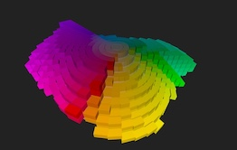

# munsell-space

  
<a href="https://sbecker11.github.io/munsell-space/">Here's </a> my Munsell Color Chips in 3-D

## See my related project <a href="https://github.com/sbecker11/workspace-munsell">workspace-munsell</a>

##  How to build this app
1. install node (how ever you like)  
2. in shell run  
3. npm run clean  
4. npm install  
5. npm run build  
3. npm run dev  

